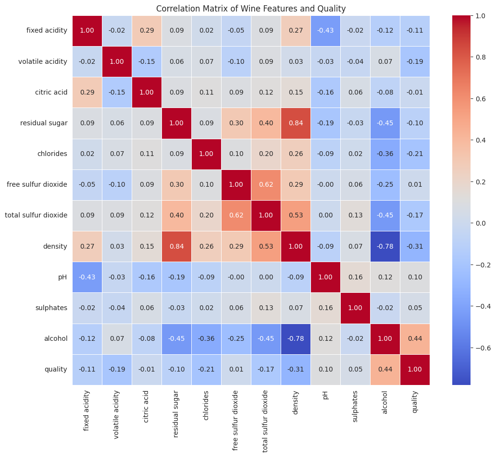

  

# BAKKOURY Salma 


# 📊 Rapport d'Analyse Exploratoire du Dataset Wine Quality (White Wine)

## 1. Introduction

Le dataset *Wine Quality* (vin blanc) provient de l'UCI Machine Learning Repository et contient des mesures physico-chimiques de vins blancs portugais ainsi qu'un score de qualité attribué par des experts.

L'objectif de cette analyse est de :

- Explorer les données ;
- Visualiser la distribution des variables ;
- Identifier les variables les plus liées à la qualité ;
- Détecter des tendances générales du dataset.

Cette analyse constitue une étape préalable essentielle avant toute modélisation de prédiction.

---

## 2. Chargement et Préparation du Dataset

```python
import pandas as pd
import numpy as np

link = "http://archive.ics.uci.edu/ml/machine-learning-databases/wine-quality/winequality-white.csv"

df = pd.read_csv(link, header="infer", delimiter=";")
print("\n========= Dataset summary ========= \n")
df.info()
print("\n========= A few first samples ========= \n")
print(df.head())

X = df.drop("quality", axis=1)  # Colonnes features
y = df["quality"]               # Variable cible

print("\n========= Wine Qualities ========= \n")
print(y.value_counts())
```

**Commentaires :**

* Le dataset contient 4 898 observations et 12 colonnes (11 features + 1 target).
* La variable cible *quality* varie généralement de 3 à 9.
* La distribution des scores est déséquilibrée : les classes 5, 6 et 7 sont majoritaires.

---

## 3. Visualisation des données

### 3.1 Distribution de la qualité du vin

```python
import matplotlib.pyplot as plt
import seaborn as sns

sns.set_style("whitegrid")

plt.figure(figsize=(8,5))
sns.countplot(x=y, hue=y, palette="viridis", legend=False)
plt.title('Distribution of Wine Quality (Target Variable)')
plt.xlabel('Quality Score')
plt.ylabel('Number of Wines')
plt.show()
```

**Analyse :**

* Les scores les plus fréquents sont 5, 6 et 7.
* Les vins de très bonne (8–9) ou très mauvaise qualité (3–4) sont rares.
* Le dataset est légèrement déséquilibré, ce qui peut influencer les modèles prédictifs.

---

### 3.2 Distribution de certaines variables sélectionnées

```python
selected_features = ['alcohol', 'volatile acidity', 'citric acid', 'residual sugar']

plt.figure(figsize=(15,10))
for i, col in enumerate(selected_features):
    plt.subplot(2,2,i+1)
    sns.histplot(X[col], kde=True, color='skyblue')
    plt.title(f'Distribution of {col}')
    plt.xlabel(col)
    plt.ylabel('Frequency')
plt.tight_layout()
plt.show()
```

 
 
**Commentaires par variable :**

* **Alcohol** : distribution légèrement asymétrique. Corrélé positivement avec la qualité.
* **Volatile Acidity** : majoritairement faible. Corrélé négativement avec la qualité.
* **Citric Acid** : valeurs centrées. Influence modérée.
* **Residual Sugar** : forte asymétrie, peu d'impact direct sur la qualité.

---

### 3.3 Matrice de corrélation

```python
df_combined = pd.concat([X, y], axis=1)
corr_matrix = df_combined.corr()

plt.figure(figsize=(12,10))
sns.heatmap(corr_matrix, annot=True, cmap='coolwarm', fmt=".2f", linewidths=.5)
plt.title('Correlation Matrix of Wine Features and Quality')
plt.show()
```

**Résultats :**

* **Corrélations positives importantes** :
  * Alcohol (~ +0.44) → variable la plus prédictive.
  * Citric acid et sulphates (faibles mais positives).
* **Corrélations négatives importantes** :
  * Density (~ –0.31) → vins plus légers = meilleure qualité.
  * Volatile Acidity (~ –0.19) → qualité dégradée.
* **Variables peu corrélées** : pH, residual sugar, chlorides.

**Conclusion partielle :**
La qualité du vin est fortement influencée par l'alcool, la densité et l'acidité volatile.

---

## 4. Conclusion générale

1. La variable cible est **centrée sur 5–7** et légèrement déséquilibrée.
2. Les distributions des variables montrent des asymétries et quelques outliers.
3. Les facteurs principaux influençant la qualité sont **alcohol**, **density** et **volatile acidity**.
4. Certaines variables (pH, residual sugar, chlorides) ont un impact limité et peuvent être moins prioritaires pour la modélisation.
5. Ces observations constituent une base solide pour appliquer un modèle de prédiction (Random Forest, SVM, Régression Linéaire).

Cette analyse permet de mieux comprendre les facteurs déterminants de la qualité des vins et sert de point de départ pour la modélisation prédictive.

